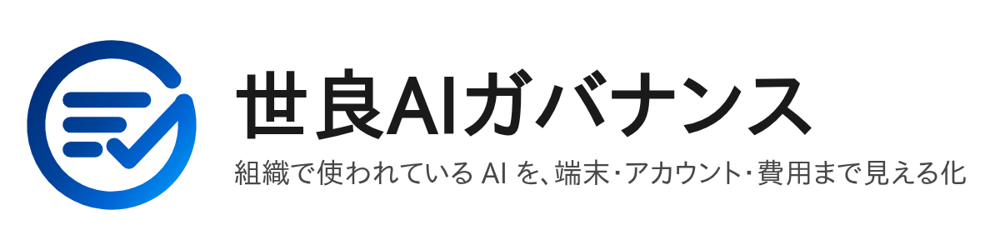
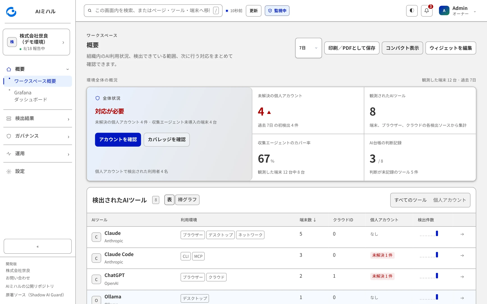

<a id="top"></a>

<p align="center">
  <picture>
    <source media="(prefers-color-scheme: dark)" srcset="assets/brand/sera-ai-governance-lockup-dark.png">
    
  </picture>
</p>

<p align="center">
  <strong>組織で使われている AI を、端末・アカウント・費用まで見える化する、自社運用のオープンソース</strong><br>
  ブラウザー・CLI・IDE・デスクトップ・ネットワーク・クラウド・MCP
</p>

<p align="center">
  <a href="#demo"><strong>デモを試す</strong></a> ·
  <a href="#install"><strong>自社環境に導入する</strong></a> ·
  <a href="#docs"><strong>ドキュメント</strong></a> ·
  <a href="#attribution"><strong>原著とライセンス</strong></a>
</p>

> **この版について**: 株式会社世良が、Aman Karir 氏の [Shadow AI Guard](https://github.com/AmanSK5/shadow-ai-guard)（Apache License 2.0）をもとに、
> 画面とメッセージの日本語化、デジタル庁デザインシステム（DADS）に基づく画面、「世良AIガバナンス」としての名称・シンボルを加えた**派生版**です。
> 試験段階のオープンソースで、**ホステッド SaaS と有償サポートは現時点で提供していません**。
> 原著プロジェクトが運営・推奨・サポートするものではありません。詳しくは[原著・ライセンス・商標](#attribution)を参照してください。

<p align="center">
  
</p>
<p align="center"><sub>概要画面の例（サンプルデータ）。画面はすべて、この README の手順で起動できるデモから撮影しています。</sub></p>

## 何ができるか

AI の利用は、ブラウザーの拡張機能、開発者の CLI、IDE のプラグイン、デスクトップアプリ、ネットワーク、クラウドのサインインなど、複数の場所に現れます。
世良AIガバナンスは、それらを同じ形の「検出結果」にそろえて集め、**どのツールが、どの端末・アカウントで使われているか**、**誰が何を判断したか**、
**有償契約と実際の利用が合っているか**を、ひとつのポータルで確認できるようにします。

| 利用環境 | 観測できるもの |
|---|---|
| **ブラウザー** | AI サイト、管理された拡張機能、アカウントのドメイン、貼り付けガードのイベント |
| **CLI** | ローカルの AI ツールと、サインインしているアカウント |
| **IDE** | AI コーディング拡張機能と連携 |
| **デスクトップ** | インストールされた AI アプリとローカルの設定 |
| **ネットワーク** | AI のドメインと、SentinelOne 経由のプロセスの特定 |
| **クラウド** | Entra のサインイン、委任アクセス、OAuth の許可、Exchange の証跡、Intune、Jamf |
| **MCP** | MCP サーバーとセキュリティ上の検出結果 |

ポータルには 18 の画面があります（概要、Grafana、ツール、利用者、端末、個人アカウント、MCP サーバー、AI 台帳、ツールレジストリ、
貼り付けガード、ISO/IEC 42001 証跡、予算、エージェント型 AI、検出ソース、収集エージェント未導入の端末、登録済み端末、登録トークン、設定）。
それぞれの画面で確認できること・できないことは、[画面と機能の一覧](docs/feature-coverage.md)に、実際の画面の動作を確認して整理しています。

主な機能:

- **検出カバレッジ**: どの検出ソースが実際に報告しているかを、設定の有無ではなく届いた検出結果から判定します。報告のないソースは、必要な設定と一緒に表示します。
- **AI 台帳**: 検出したツールごとに、利用判断・責任者・レビュー期限を記録します。承認は「安全」を意味せず、検出結果の重大度は変えません。
- **個人アカウントの把握**: 会社のドメイン以外でサインインしている利用者を、「確認済み」または理由付きの「許容」として記録できます。
- **貼り付けガード**: 対応ブラウザーの拡張機能が、機密情報らしい貼り付けを検査して警告またはブロックします。報告するのは検出ルールの識別子とアカウントのドメインだけで、貼り付けた内容は報告しません。
- **予算**: AI ツールの契約（プラン・席数・単価）と実際の利用を突き合わせ、使われていない有償席や、席のない利用者を確認します。
- **エージェント型 AI**: 人の操作なしに動く AI の処理と、その認証情報の持ち主を確認します。
- **証跡**: ISO/IEC 42001 に関連する記録を、期間を指定して印刷／PDF または JSON（検査用ハッシュ付き）で出力します。**適合の判定や認証取得を保証するものではありません。**

<a id="demo"></a>

## 試す（5 分のデモ）

Docker（Compose v2）があれば、クラスターや認証情報なしで、実物のポータル・受信サービス・ログ保存先・Grafana を架空のデータで動かせます。

```bash
git clone https://github.com/sera-inc/sera-ai-governance.git
cd sera-ai-governance/demo
docker compose up -d --build
```

- **ポータル**: <http://localhost:8091>（ユーザー名 `admin`、パスワード `admin-demo-portal`。デモ専用の公開値です）
- **Grafana**: <http://localhost:3000>
- **貼り付けガードの動作デモ**: <http://localhost:8090/demo/>（拡張機能の `guard.js` をそのまま動かします）

使うポート: 8091（ポータル）、8080（受信サービス）、3000（Grafana）、3100（ログ保存先）、8090（貼り付けガードのデモ）、8025（メール受信箱）、8092（疑似の ID プロバイダー）。
すべて `127.0.0.1` だけに公開します。ユーザー名と端末名は、すべて架空の日本の姓にもとづく作り物です。

サンプルデータ、疑似の Entra、メール受信箱（Mailpit）、拡張機能のデモは**デモ専用**です。本番の構成には含めないでください。
停止は `docker compose down`、データも消す場合は `docker compose down -v` です。詳しくは [demo/README.md](demo/README.md) を参照してください。

<a id="install"></a>

## 自社環境に導入する（最小の Docker Compose）

動作を確認している導入経路は Docker Compose です。受信サービス・ポータル・スキャナー（と、`--profile discovery` を付けたときのディスカバリー）のイメージは、**クローンしたこのリポジトリからビルドされます**。
原著のイメージは取得しません。

```bash
git clone https://github.com/sera-inc/sera-ai-governance.git
cd sera-ai-governance/deploy/compose
cp .env.example .env
mkdir -p secrets && openssl rand -hex 32 > secrets/auth_token
chmod 700 secrets && chmod 640 secrets/* && sudo chown :65532 secrets/*
docker compose up -d --build
docker compose logs receiver | grep setup_code
```

ポータルは `127.0.0.1:8091`、受信サービスは `127.0.0.1:8080` で待ち受けます。ログに出たセットアップコードでオーナーのアカウントを作成すると、初回のセットアップウィザードが残りの設定
（受信サービスの公開 URL、ログ保存先、企業ドメインなど）を案内します。外部へ公開する場合は、HTTPS のリバースプロキシを前に置き、管理画面を認証付きにしてください。
ログ保存先（Loki）と Grafana が無い場合は、`.env` の `LOKI_PUSH_URL` と `LOKI_URL` を設定したうえで `docker compose --profile with-logs up -d` で同梱のものを起動できます。詳しい手順・環境変数・バックアップは [deploy/compose/README.md](deploy/compose/README.md) を参照してください。

**Kubernetes（Helm）について**: チャートは同梱していますが、既定のイメージ参照は原著のもの（英語版）で、この派生版のイメージは公開していません。この派生版を Kubernetes で動かす場合は、
このリポジトリからイメージをビルドして自組織のレジストリに置き、`image.repository` などを上書きしてください。**この経路の動作確認は行っていません。**

### 画面のデザイン（DADS）

ポータルの画面は、デジタル庁デザインシステム（DADS）のデザイントークンを土台にしています。トークンは、公開パッケージ
[`@digital-go-jp/tailwind-theme-plugin`](https://github.com/digital-go-jp/tailwind-theme-plugin) 1.0.1（MIT ライセンス）から `tools/dads` で生成して**同梱**しているため、
クローンして起動するだけで同じ見た目になります。private のデザインシステムの内容は含みません。確認方法は、システム状態画面の「デザイントークン」が「同梱」であることと、
ポータルのログの `DADS tokens: bundled` です。組織が自前のトークンを持つ場合は、読み取り専用でマウントして置き換えることもできます。
これは**管理者試験の位置づけ**で、デザインシステムの正式な採用、全画面の移行、アクセシビリティの承認を意味しません。範囲と限界は [docs/dads-runtime-mount.md](docs/dads-runtime-mount.md) にあります。

## 収集の範囲と限界

- すべての AI 利用を網羅するものではありません。検出できる範囲は、導入した収集エージェント、端末の設定、ブラウザー、各サービスの仕様に依存します。**未検出は未利用の証拠ではありません。**
- 収集エージェントは設定ファイルを読み、どのアカウントのドメインでサインインしているかを報告します。メッセージの内容、ファイルの内容、認証情報は読みません（[docs/deployment-privacy.md](docs/deployment-privacy.md)）。
- 端末と利用者の対応は、管理者が対応表を登録した場合にだけ表示します。名前の一致から候補は提案しますが、自動では適用しません。
- 予算は、登録した契約の単価と席数から算出します。各サービスの実際の請求額を自動で取得するものではありません。

## リソースの目安

計測値と推奨値は分けて書きます。

- **計測値（2026-09-30、アイドル時）**: 8 vCPU・16 GiB の Docker ホストで、受信サービス・ポータル・スキャナーの 3 コンテナ（最小の Compose 構成）は合計約 116 MiB。
  デモの 7 コンテナ（Loki、Grafana、疑似の Entra、メール受信箱、拡張機能デモ込み）は合計約 890 MiB で、うち Grafana が約 640 MiB でした。サンプルデータのみで、負荷試験ではありません。
  最小の Compose のスキャナーは、認証情報を設定しておらず、検出を実行していない（待機している）状態の値です。
- **推奨値は確立していません。** 端末数、検出結果の量、ログの保存期間、バックアップと復元にかかる時間は計測していません。2 vCPU・4 GB 程度の仮想マシンは**出発点の候補**ですが、
  実データを扱う前に、負荷・保存期間・バックアップ・復元を自組織の条件で試験してください。

## 既知の制限

- 世良AIガバナンスは試験段階の OSS です。可用性・サポート水準・特定の規格への適合を保証しません。
- 最小の Compose 構成のスキャナーは、クラウド側の認証情報（Entra、Jamf、SentinelOne など。`scanner.env`）を設定するまで検出を実行しません。そのあいだ、ログに `no scanner ran: check credentials and policy.yaml` と出て、`docker compose ps` では `unhealthy` と表示されます（2026-09-30 に手元のビルドで確認）。未設定の状態を示す表示で、ほかのサービスはこのコンテナに依存しません。
- ポータルの「更新」カードは原著のリリース情報を参照する作りのため、この派生版の Compose 構成では既定でオフにしています（`UPDATE_CHECK`）。更新は `git pull` と `docker compose up -d --build` です。
- Kubernetes（Helm）の経路、Jamf・Intune・SentinelOne などの外部サービスとの実接続は、この環境では確認していません（疑似の ID プロバイダーとサンプルデータで確認）。
- ブラウザー拡張機能が動作するブラウザー、対象サイト、ポリシーの範囲は、導入前に確認してください。

<a id="docs"></a>

## ドキュメント

| 目的 | 文書 |
|---|---|
| 画面ごとに確認できること・限界 | [docs/feature-coverage.md](docs/feature-coverage.md) |
| 最初の 1 件の検出まで | [docs/getting-started.md](docs/getting-started.md)（英語・原著由来） |
| Docker Compose での導入 | [deploy/compose/README.md](deploy/compose/README.md) |
| デモ | [demo/README.md](demo/README.md) |
| 設計の考え方 | [docs/architecture.md](docs/architecture.md) |
| AI 台帳と判断の記録 | [docs/governance.md](docs/governance.md) |
| 予算 | [docs/budget.md](docs/budget.md) |
| エージェント型 AI | [docs/agentic.md](docs/agentic.md) |
| 証跡 | [docs/evidence.md](docs/evidence.md) |
| 収集するもの・しないもの | [docs/deployment-privacy.md](docs/deployment-privacy.md) |
| DADS の適用範囲と限界 | [docs/dads-runtime-mount.md](docs/dads-runtime-mount.md)、[docs/mapping.md](docs/mapping.md)、[docs/deviations.md](docs/deviations.md) |
| 日本語表記の方針 | [docs/ja-ui-copy-review.md](docs/ja-ui-copy-review.md) |
| ブランド素材と由来 | [assets/brand/README.md](assets/brand/README.md) |
| 画面と動画の撮影（開発者向け） | [tools/screenshots/README.md](tools/screenshots/README.md) |
| セキュリティモデル | [SECURITY.md](SECURITY.md) |
| 原著の README（英語） | [docs/upstream-README.md](docs/upstream-README.md) |

テストの実行方法は [TESTING.md](TESTING.md) と [CLAUDE.md](CLAUDE.md) にあります。

<a id="attribution"></a>

## 原著・ライセンス・商標

- **原著**: Shadow AI Guard（作者 Aman Karir 氏）<https://github.com/AmanSK5/shadow-ai-guard>。著作権表示は [NOTICE](NOTICE) とソースファイルの表示にあり、削除・変更していません。
- **ライセンス**: [Apache License 2.0](LICENSE)。この派生版も同じライセンスで公開します。改変の内容は、このリポジトリの git 履歴と [NOTICE](NOTICE) に記載しています。
- **独立した提供**: 世良AIガバナンスは株式会社世良が独立して提供する派生版で、Shadow AI Guard プロジェクトが運営・推奨・サポートするものではありません。
  原著のソフトウェアは、公式のリポジトリから無償で入手できます。
- **名称とロゴ**: 「Shadow AI Guard」の名称とロゴは原著の作者が商標として主張しています（[TRADEMARKS.md](TRADEMARKS.md)）。この派生版は原著のロゴを使わず、別の名称とシンボルを使います。
  シンボルの由来は [assets/brand/README.md](assets/brand/README.md) に記録しています。
- **デジタル庁デザインシステム**: デザイントークンは、デジタル庁の公開パッケージ（MIT ライセンス）から機械的に変換したものです。デジタル庁が提供・推奨するものではありません（[NOTICE](NOTICE)）。

<p align="right"><a href="#top">先頭へ ↑</a></p>

---

## English summary

**Sera AI Governance (世良AIガバナンス)** is a Japanese-language, self-hosted open-source derivative of
[Shadow AI Guard](https://github.com/AmanSK5/shadow-ai-guard) by Aman Karir (Apache License 2.0), modified by Sera Inc. (株式会社世良).
It shows which AI tools are used across browsers, CLIs, IDEs, desktop apps, the network, the cloud and MCP, on which devices and accounts,
what the organisation decided about each tool, and whether paid seats match real use.

- Try it: `git clone https://github.com/sera-inc/sera-ai-governance.git && cd sera-ai-governance/demo && docker compose up -d --build`, then open <http://localhost:8091> (`admin` / `admin-demo-portal`, demo-only). All data is fictional.
- Deploy: Docker Compose under [`deploy/compose`](deploy/compose/README.md), built from this checkout. The Helm chart is included but points at the upstream project's English images by default; that route is unverified for this fork.
- Status: an experimental OSS release. No hosted service and no paid support are offered. Not operated, supported or endorsed by the Shadow AI Guard project or the Digital Agency of Japan.
- Upstream README: [docs/upstream-README.md](docs/upstream-README.md). Licence and attribution: [LICENSE](LICENSE), [NOTICE](NOTICE), [TRADEMARKS.md](TRADEMARKS.md).
