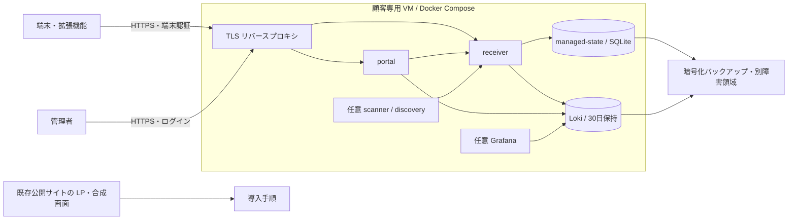

# AIミハルの最小構成とクラウド費用比較

調査日: 2026-10-01。これは構成検討用の試算で、発注・契約・本番クラウドへの配備は実施していない。価格は税別 USD、円換算は比較用の **1 USD = 150 円という仮定**（実勢為替ではない）。地域、税、為替、割引、既存契約で請求額は変わる。

## 結論

ゼロ顧客時は公開 LP と合成データの必要時デモだけを残し、収集用サーバーは停止する。初期の実顧客には **顧客ごとに独立した VM と Docker Compose** が実装負担の少ない候補。新規 AWS 環境なら Lightsail 4 GB の月額 $24 が比較しやすい出発点。既存 GCP/Azure 環境・運用担当者があるなら、月数ドルの差より既存運用を優先する。4 GB は容量保証ではなく負荷試験開始点である。

Lovable は LP/新規フロントエンドの開発基盤として比較できるが、既存 Python サービス、Loki、SQLite の Compose 一式をそのまま移す代替 VM ではない。Cloudflare も静的 LP に適するが、Workers の $5 に本製品全体の常駐コンテナ費が含まれるわけではない。

## 現物の前提

確認: [README](../README.md)、[アーキテクチャ](architecture.md)、[Compose](../deploy/compose/docker-compose.yml)、[導入手順](../deploy/compose/README.md)。receiver は finding を受信し Loki へ送信、portal は Loki を読む。managed mode では receiver の `/var/lib/ai-guard/state.db` を named volume `managed-state` へ永続化する。古い「stateless」説明だけを根拠に scale-to-zero へ移行しない。scanner/discovery の認証状態も volume を使用する。Grafana はログ画面用、registry-builder は一度だけ実行する。

複数社の強固な論理分離はこの調査で実証していない。初期 B2B の費用は 1 社 1 環境で計算し、共同 DB に複数顧客を置くことを既存実装の機能として扱わない。README の以前のアイドル計測（最小 3 コンテナ約 116 MiB、デモ約 890 MiB）は負荷保証に使わない。

## 共通試算条件

- ゼロ顧客: LP のみ常時公開、合成データのデモは必要時起動。既存公開 site を使う場合の増分ホスティング費は契約の範囲内なら $0。常駐 VM を残せば通常の月額料金がかかる。
- 小規模 B2B: 1 社 50 台、30 日保存、1 台 1 日 100 finding、1 件 2 KB と仮定。月 150,000 件、未圧縮約 0.3 GB。索引・監査・重複・バックアップを含め 10 倍余裕で約 3 GB/月。これは実測ではない。
- 比較用 730 時間/月（2,628,000 秒）。VM は 2 vCPU/4 GB を開始候補とする。サーバーレスの例は単価の見える化のため合計 1 vCPU/2 GiB 常時 active。VM と性能同等という意味ではない。
- 除外: ドメイン、メール、追加転送、監視外部サービス、バックアップ保管、サポート人件費、外部 SaaS/MDM、任意 discovery の LLM API。商用見積もりでは追加する。

## 5 基盤の比較

| 基盤 | 現実的な導入経路 | ゼロ顧客時 | 小規模時の条件付き計算 | 初期実装工数の見立て |
|---|---|---|---|---|
| AWS | Lightsail Linux/Unix、IPv4、2 vCPU/4 GB/80 GB | 不要な VM を作らなければ $0。保持すれば $24/月 | **$24/月（約3,600円）** + バックアップ等。公式 bundle の転送枠内想定 | 1–3 人日: Compose、TLS、バックアップ、復元試験 |
| GCP | Compute Engine e2-medium + disk。Cloud Run は永続状態を再設計してから | VM 未作成なら $0。停止でも disk 等は残る | 米国参考 e2-medium $0.03350571/h ×730 = **$24.46/月**、disk/IP/通信別。日本リージョン見積は要再取得 | VM 1–3 人日。Cloud Run 化 5–15 人日 |
| Azure | VM + Compose を第一候補。Container Apps は永続化/ジョブ分離の設計後 | 消費プランのゼロ replica の compute は $0、保存/ログ等別 | 公式動的価格の数値を取得できず **総額未確定**。下記の使用量式で公式 calculator を使用 | VM 1–3 人日。Container Apps 化 5–15 人日 |
| Lovable | LP / 新規 UI。既存 backend は別ホスト | Free の範囲で開発可。Cloud 消費枠と実使用を区別 | Pro **$25/月〜**は開発 credits を含むプラン。既存 backend $24/月なら単純合算 **$49/月〜**、Cloud 超過別。製品全体の実行料ではない | LP 1–3 人日。既存 backend 置換は 15–30 人日以上、現時点では非推奨 |
| Cloudflare | Pages/Workers の LP + VM backend。Containers への移植も別途評価 | 静的 LP が無料枠内なら $0 | LP + AWS VM **$24/月〜**。Workers Paid を使えば $29/月〜。Containers 全体の $5 移行とはしない | LP 1–2 人日。Containers 永続化移植 5–15 人日 |

工数は担当者の経験がある前提の計画上の推定で、ベンダー見積・実績ではない。1 人日 8 時間、社内原価を仮に 5,000 円/時とすると 1–3 人日 = 4–12 万円、5–15 人日 = 20–60 万円。複雑な SSO/ネットワーク審査は含まない。

一次出典: [AWS Lightsail pricing](https://aws.amazon.com/lightsail/pricing/)、[GCP General Purpose VM pricing](https://cloud.google.com/products/compute/pricing/general-purpose)、[Azure Container Apps pricing](https://azure.microsoft.com/en-us/pricing/details/container-apps/)、[Lovable pricing](https://lovable.dev/pricing)、[Lovable Cloud](https://docs.lovable.dev/features/cloud)、[Workers pricing](https://developers.cloudflare.com/workers/platform/pricing/)。GCP の公式価格表本文は取得エラーになったが、公式ページの検索結果で上記 hourly rate を確認。リージョンを選択した正式見積もりを代替するものではない。

## サーバーレスの計算と制約

GCP Cloud Run instance-based、us-central1 の公式表示: CPU $0.000018/vCPU秒、RAM $0.000002/GiB秒、無料枠 240,000 vCPU秒/450,000 GiB秒。合計 1 vCPU/2 GiB を常駐させる計算は `(2628000−240000)×0.000018 + (5256000−450000)×0.000002 = $52.596/月`（約7,889円）。状態 DB、Loki、scanner 実行、通信等は追加で、これは製品全体の見積もりではない。[公式単価](https://cloud.google.com/run/pricing)

Azure Container Apps の無料枠は月 180,000 vCPU秒、360,000 GiB秒、200万 request。上と同じ active 使用量なら `2,448,000×CPU単価 + 4,896,000×RAM単価`、リクエスト15万は枠内。他アプリと無料枠を共有する。価格ページの数値が動的表示で取得できず、Retail Prices API もこの環境の outbound proxy で HTTP 403 になったため、未検証単価を埋めていない。[公式課金仕様](https://learn.microsoft.com/en-us/azure/container-apps/billing)

Cloudflare Containers: memory $0.0000025/GiB秒、CPU実使用 $0.000020/vCPU秒、disk $0.00000007/GB秒。含まれる枠を差し引き、2 GiB 常時・平均実CPU 0.1 core・disk 8 GB の説明用例は `$5 + (5256000−90000)×0.0000025 + (262800−22500)×0.000020 + (21024000−720000)×0.00000007 = $24.14228/月`。ネットワーク等別。割当可能 instance size の確認が必要な計算例で、配備済み構成ではない。[公式料金](https://developers.cloudflare.com/containers/platform/pricing/)

Cloudflare の disk は既定で ephemeral。snapshot は継続書き込みの永続 DB と同じではない。SQLite を置くだけでは安全に移行できないため外部永続化、再起動、復元試験が必要。[公式 lifecycle](https://developers.cloudflare.com/containers/concepts/architecture/)

## 推奨最小アーキテクチャ

## Compose の最小化案（提案、今回コード変更なし）

1. registry-builder、receiver、portal、Loki を維持。既存 Loki があればそれを使用。Grafana を独立した任意 profile にし、使わない場合は設定画面に未接続を明示。グラフ機能を削除しない。
2. scanner を任意 profile にし、認証情報がないゼロ顧客時の無意味な常駐と unhealthy を避ける。クラウド収集時に明示的に有効化。discovery は既存 profile を維持し任意 LLM 料金を別計上。
3. volume、secrets、loopback port を保持。TLS のみ外部公開。全社共有 token から端末 credential へ移す既存経路を維持。
4. Loki に保持期間とディスク上限を明示。Docker stdout の log rotation、コンテナ resource limit、失敗時通知を追加。SQLite は稼働中の単純ファイルコピーでなく整合性のある backup API/停止バックアップを使う。
5. 導入前に 50/100/300 台相当の合成 ingest、ピーク、30日相当の検索、再起動、権限、バックアップ復元を試験。保存結果と台帳の一致を確認してから適正 VM サイズを確定。

## 残る確認

Azure 日本リージョンの正式金額、GCP 日本リージョンの disk/IP 込み金額、実測性能、外部接続、復元 RPO/RTO は未検証。単一 VM は単一障害点。高可用性・24時間監視をこの費用や既存製品の提供機能として約束しない。
